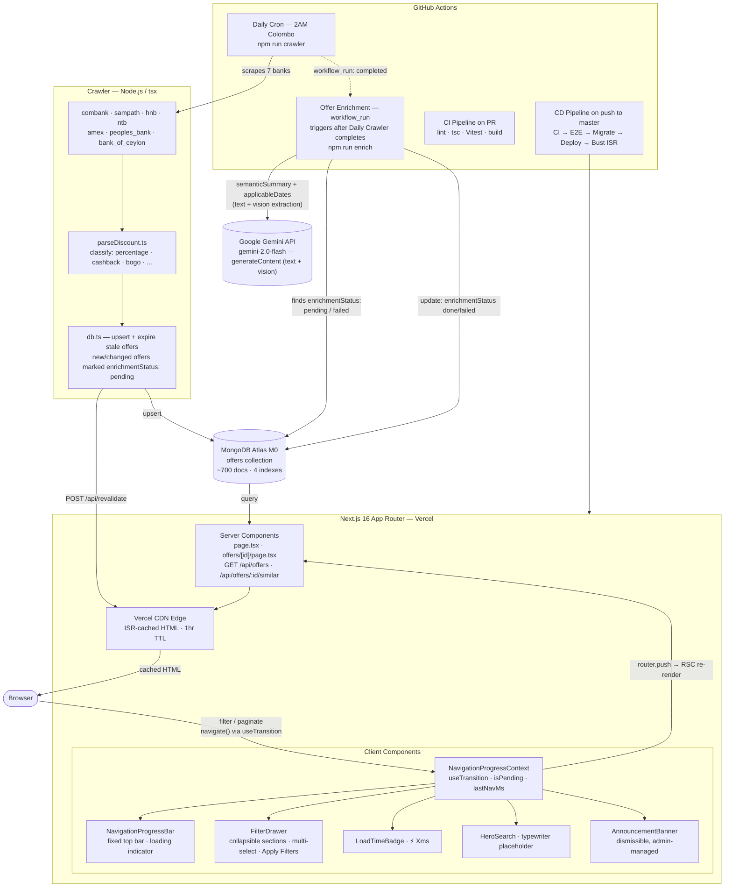
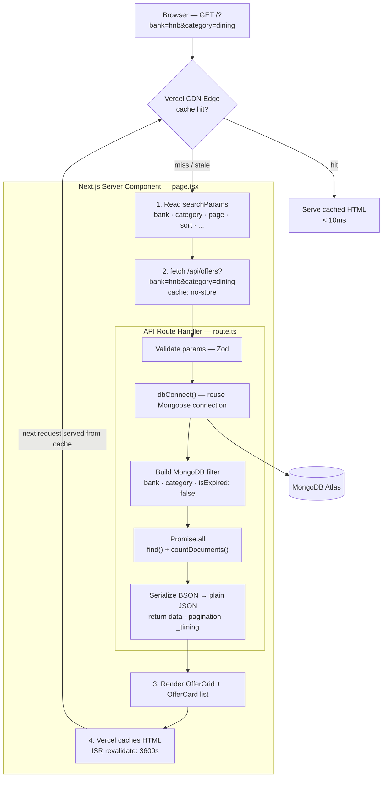
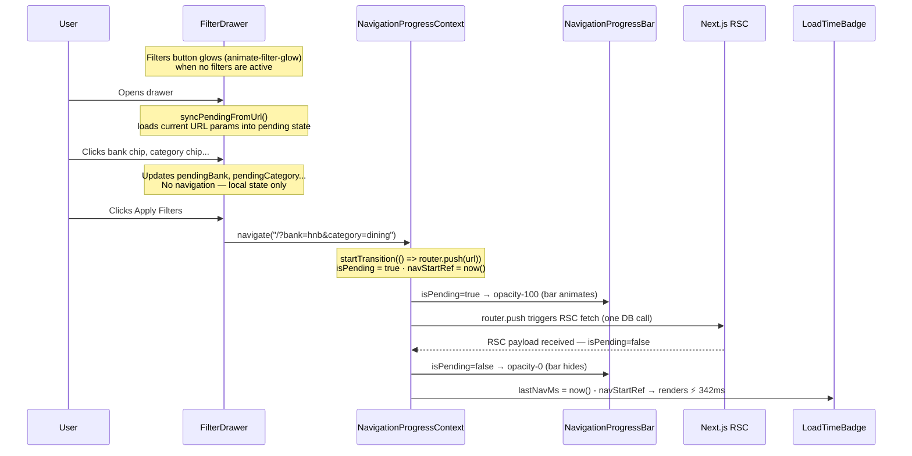
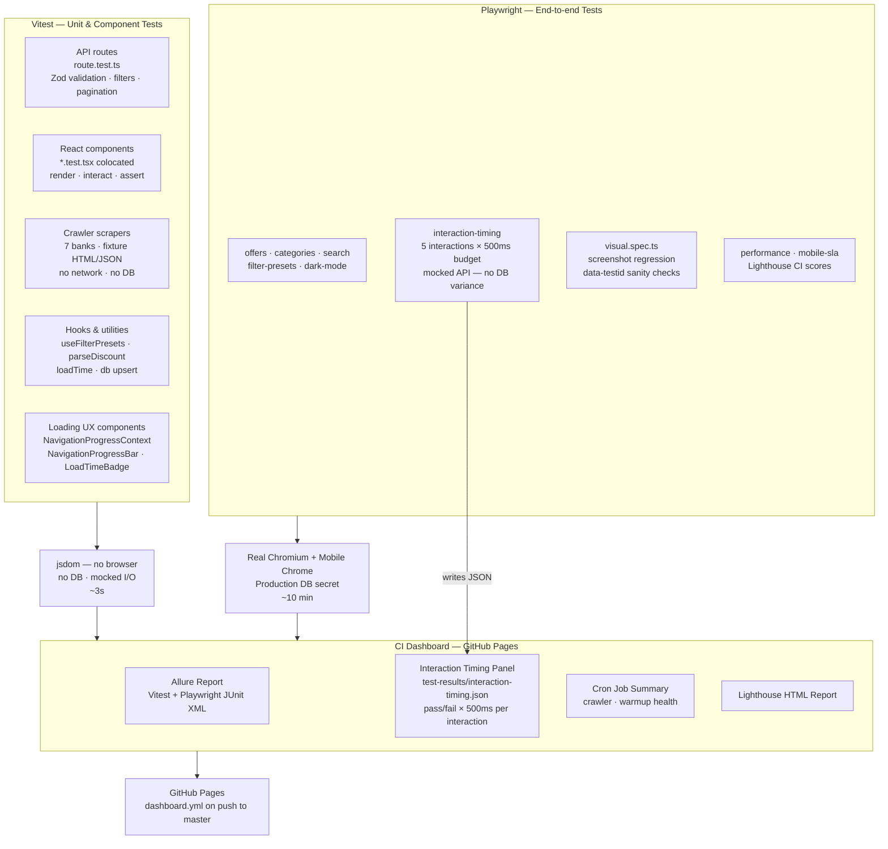
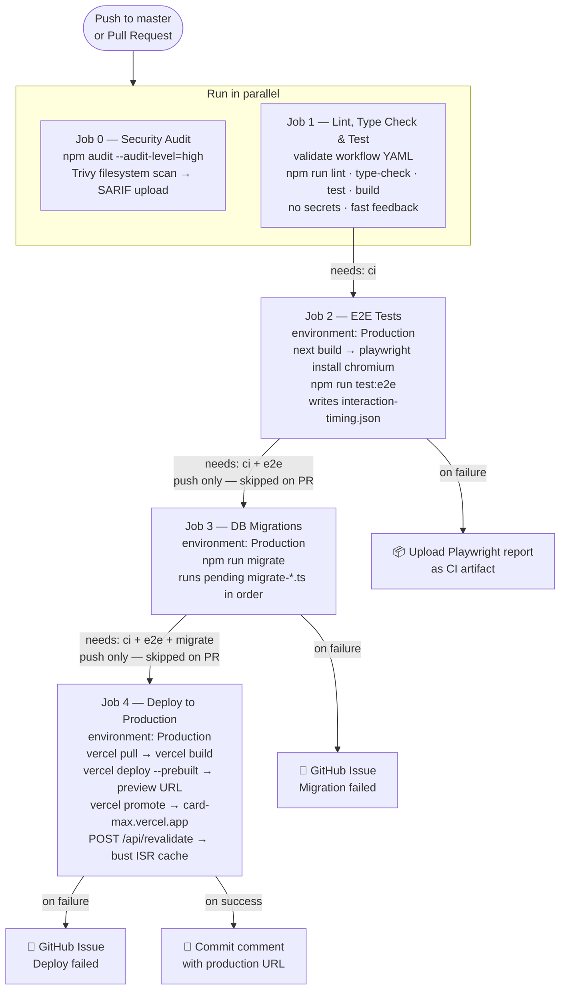
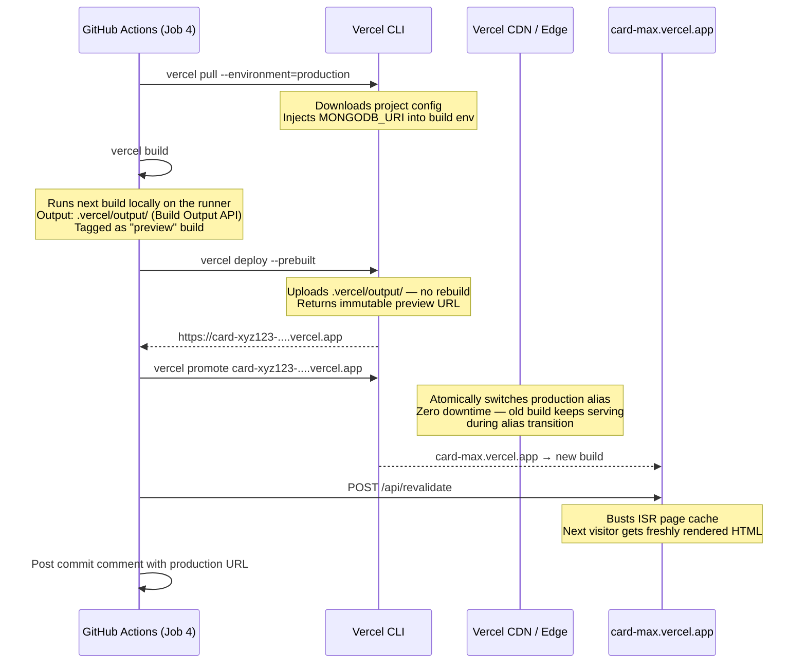
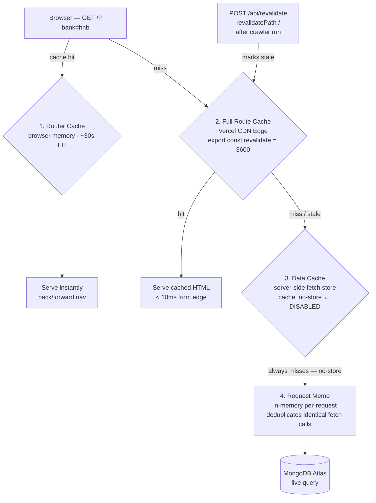
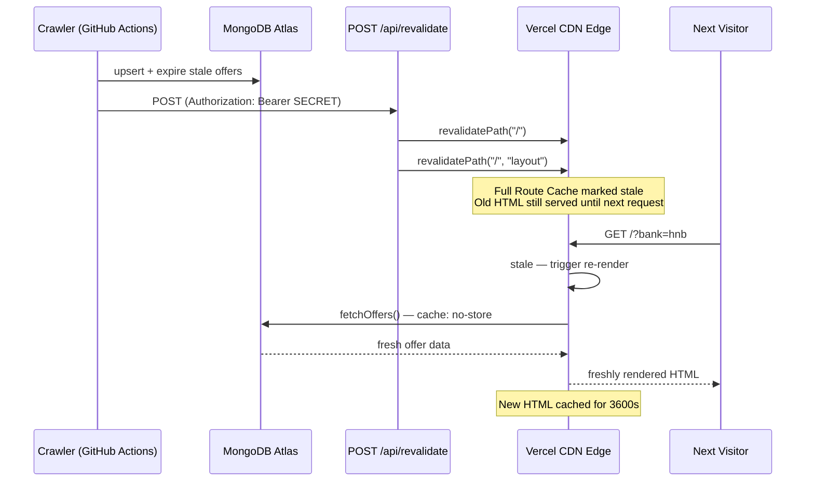

# card-max

> Sri Lankan credit card offers aggregator — scrapes all current deals from Commercial Bank, Sampath Bank, HNB, Nations Trust Bank, American Express (NTB), People's Bank, and Bank of Ceylon into one searchable, filterable feed.

**Live:** https://www.card-max.com &nbsp;|&nbsp; **Stack:** Next.js 16 · MongoDB Atlas · GitHub Actions · Vercel

---

## Table of Contents

1. [Architecture Overview](#architecture-overview)
2. [System Design Diagram](#system-design-diagram)
   - [Navigation & Loading UX Flow](#navigation--loading-ux-flow)
3. [Crawler Design](#crawler-design)
   - [Strategy Overview](#strategy-overview)
   - [Per-Bank Strategies](#per-bank-strategies)
   - [Crawler Pipeline](#crawler-pipeline)
   - [Alternative & Agentic Approaches](#alternative--agentic-approaches)
4. [Data Model](#data-model)
   - [Category Consolidation](#category-consolidation-spec-048)
5. [Frontend Architecture](#frontend-architecture)
6. [API Reference](#api-reference)
7. [Getting Started](#getting-started)
8. [Testing](#testing)
   - [Test suite architecture](#test-suite-architecture)
9. [CI / Continuous Integration](#ci--continuous-integration)
   - [GitHub Actions Workflows](#github-actions-workflows)
   - [When the pipeline runs](#when-the-pipeline-runs)
   - [Pipeline flow](#pipeline-flow)
   - [Test layers](#test-layers)
   - [Secrets & environments](#secrets--environments)
10. [DB Migrations](#db-migrations)
    - [How migrations run in CD](#how-migrations-run-in-cd)
    - [Writing a new migration](#writing-a-new-migration)
    - [Migration registry](#migration-registry)
11. [Deployment](#deployment)
    - [The four-step deploy pipeline](#the-four-step-deploy-pipeline)
    - [Why build as preview then promote](#why-build-as-preview-then-promote-not-deploy-with---prod-directly)
    - [What "preview" means in Vercel's model](#what-preview-means-in-vercels-model)
    - [Rollback](#rollback)
    - [Secrets required](#secrets-required)
    - [Daily crawler cron](#daily-crawler-cron)
    - [Offer enrichment (triggered, not scheduled)](#offer-enrichment-triggered-not-scheduled)
12. [Caching Architecture](#caching-architecture)
    - [The four caches](#the-four-caches)
    - [How this project uses each layer](#how-this-project-uses-each-layer)
    - [How revalidation works after a crawler run](#how-revalidation-works-after-a-crawler-run)
13. [Known Limitations & Roadmap](#known-limitations--roadmap)
14. [Spec-Driven Development & Automation](#spec-driven-development--automation)
    - [GitHub Spec Kit](#github-spec-kit)
    - [Issue → Spec → Implementation lifecycle](#issue--spec--implementation-lifecycle)

---

## Architecture Overview



> **Note:** the Offer Enrichment workflow updates MongoDB directly but does **not** call
> `/api/revalidate` itself — enriched fields (`semanticSummary`, `applicableDates`) become
> visible on the next natural ISR revalidation rather than busting the cache immediately,
> since enrichment is best-effort and decoupled from the user-facing scrape/cache-bust path
> (see [Architecture Decision in spec 044](specs/features/044-ai-offer-enrichment.md)).

---

## System Design Diagram



### Navigation & Loading UX Flow



---

## Crawler Design

### Strategy Overview

Each bank website is different. The crawler selects the appropriate strategy per bank:

| Strategy | When to use | Banks using it |
|----------|-------------|----------------|
| **REST API client** | Bank exposes a public JSON API | Sampath, HNB |
| **2-phase HTML scrape** | Server-rendered HTML listing → detail pages | ComBank |
| **Plain HTTP HTML scrape** | Server-rendered HTML, category pages | AmEx NTB |
| **HTTP-first + Playwright fallback** | Incapsula bot-protection; HTTP works from residential IPs | NTB |
| **Agentic / LLM-assisted (future)** | Unstructured layouts, no consistent selectors | Any |

### Per-Bank Strategies

#### Commercial Bank — 2-Phase HTML Scrape

```
Phase 1: GET combank.lk/rewards-promotions
   │  Parse all <a href="/rewards-promotion/[category]/[slug]"> links
   │  Extract category from URL path segment
   ▼
Phase 2: GET each detail URL (max 5 concurrent, 800ms delay)
   │  Parse <h2> title
   │  Parse og:image meta tag → merchantLogoUrl (decode HTML entities)
   │  Parse "Offer valid till DD Month YYYY" → validUntil Date
   │  Extract discount text → parseDiscount() → offerType + discountPercentage
   ▼
Upsert to MongoDB (match on bank + merchant + title)
```

**Why this approach:** ComBank's offers are server-rendered HTML. Each offer has a dedicated
detail page with structured content. Two phases are needed because the listing page only has
links — discount values and dates are on the detail pages.

**Known fragility:** HTML structure changes break the regex selectors. Monitor for 0-offer
runs as an early warning.

#### Sampath Bank — REST API Client

```
GET sampath.lk/api/card-promotions?page_number=1&size=200
   │  Returns JSON: { data?: [...] } or bare array
   │  Fields: company_name, short_discount, category,
   │          expire_on (Unix ms as STRING), display_on, image_url, cards_new
   ▼
Map each item:
   │  merchant = company_name
   │  parseDiscount(short_discount) → offerType + discountPercentage + discountLabel
   │  parseTimestamp(expire_on) → validUntil  ← must handle numeric strings
   ▼
Upsert to MongoDB
```

**Why this approach:** Sampath runs a Nuxt.js SPA that fetches data from a public API
endpoint (`/api/card-promotions`). Hitting the API directly is faster, more reliable, and
returns structured data — no HTML parsing needed.

**Known quirk:** `expire_on` and `display_on` are returned as numeric strings
(`"1745000000000"`), not numbers. `new Date("1745000000000")` is `Invalid Date` — must
parse via `parseInt()` first.

#### HNB — REST API Client

```
GET venus.hnb.lk/api/get_all_pcard_promotions
   │  Returns JSON: { status: 200, data: [...] }
   │  Fields: id, title, thumbUrl, from (YYYY-MM-DD), to (YYYY-MM-DD),
   │          card_type ("credit"|"debit"|"credit/debit"), content (HTML)
   ▼
Filter: keep only card_type includes "credit"
Map each item:
   │  merchant = extract "at [Merchant]" from title
   │  parseDiscount(extract % from content HTML) → offerType + discountPercentage
   │  category = keyword detection on title + content
   ▼
Upsert to MongoDB
```

**Why this approach:** HNB's website is a React SPA. The HTML served at `/personal/cards`
is a shell with no offer data. The actual data comes from `venus.hnb.lk` — a separate
API domain discovered via browser network tab inspection. Hitting the API directly avoids
all SPA complexity.

**Known issue:** `venus.hnb.lk` occasionally returns empty responses or 5xx. The retry
logic in `fetchJson()` handles transient failures. The overall crawler continues even if
HNB fails (`Promise.allSettled`).

#### NTB (Nations Trust Bank) — Session-Based HTML Scrape

```
Step 1: GET nationstrust.com (home page)
   │  Captures Incapsula session cookies in cookieJar Map
   ▼
Step 2: GET known promotion listing URLs
   │  Uses cookieJar + Referer header to appear as browser navigation
   │  Check for "Incapsula incident ID" in response → blocked → return []
   │  Parse <a href="/promotions/what-s-new/[slug]"> links
   ▼
Step 3: GET each campaign detail page (max 3 concurrent)
   │  Parse HTML <table> with columns: Merchant | Offer | Eligibility
   │  Each table row → one offer
   │  Fallback: treat full page as one offer if no table found
   ▼
Upsert to MongoDB
```

**Why this approach:** NTB uses Incapsula bot protection. The HTTP-first path works from
residential/GitHub Actions IPs in many cases. When blocked, Crawlee's PlaywrightCrawler
launches real Chromium with randomised browser fingerprints and handles the JS challenge
by waiting for actual content selectors (`waitForSelector`) instead of the unreliable
`networkidle` state (Incapsula's challenge JS polls the network continuously, which
causes `networkidle` to never fire).

**Current status:** HTTP-first path typically scrapes 121+ offers. Crawlee fallback
activates automatically if Incapsula blocks the HTTP path. Both paths extract the best
available image from each campaign page (og:image → twitter:image → prominent ``).

#### AmEx (American Express NTB) — Plain HTTP Category Scrape

```
Phase 1: For each of 11 known category URLs under americanexpress.lk/en/offers/*
   │  (dining, wellness, supermarket, lodging, homecare, clothing,
   │   online, travel, healthcare, installments, special)
   │  Using session cookies for Incapsula bypass
   ▼
Phase 2: Parse each .alloffer-box block
   │  merchant = .alloffer-heading
   │  discountText = .value-limit span
   │  validityText = "Valid till/from" text
   │  detailUrl = <a href> within the block
   │  imageUrl = 5-pattern extraction chain:
   │    1. 
   │    2.   (AEM CMS relative path)
   │    3. CSS background-image: url("https://...") inline style
   │    4. CSS background-image: url("/content/...")
   │    5. Any absolute  with image extension (.jpg/.png/.webp)
   ▼
Upsert to MongoDB — 271 offers across 11 categories
```

**Why this approach:** americanexpress.lk is server-side rendered — plain HTTP works.
Offers are organised by category listing pages. The scraper iterates all known category
URLs, extracts offer blocks with regex, and handles both `` tags and CSS
`background-image` inline styles for merchant images (the site uses both).

**Image resolution chain (display time):** When no scraped `merchantLogoUrl` is stored,
`OfferImage.tsx` falls back to Google's favicon service (`google.com/s2/favicons?domain=...`)
using the `MERCHANT_DOMAINS` map in `crawler/utils/logo.ts` (40+ curated Sri Lankan merchant
domains; the function is still named `buildClearbitUrl` for historical reasons — it no
longer calls Clearbit, see #97). If that also fails, a gradient icon with the category
symbol and merchant name is shown. Bank-hosted `merchantLogoUrl` images render with
`referrerPolicy="no-referrer"` so bank hotlink-protection doesn't block them (#97).

### Crawler Pipeline

```
crawler/run.ts
     │
     ├── connectDb()
     │
     ├── Promise.allSettled([
     │     combank.scrape(),   ─────────────────────────┐
     │     sampath.scrape(),   ──────────────────────┐  │
     │     hnb.scrape(),       ──────────────────┐   │  │
     │     ntb.scrape()        ──────────────┐   │   │  │
     │   ])                                  │   │   │  │
     │                                       ▼   ▼   ▼  ▼
     │                              (all run in parallel)
     │
     ├── For each settled result:
     │     ├── SUCCESS → upsertOffers(offers) + expireStaleOffers(bank, offers)
     │     └── FAILURE → log error, mark hasError=true
     │
     ├── disconnectDb()
     │
     ├── Log structured JSON summary to stdout
     │     { timestamp, summaries[], totalScraped, totalInserted, errors }
     │
     └── process.exit(hasError ? 1 : 0)
              │
              └── Non-zero exit → GitHub Actions marks the step FAILED
                                → Creates a GitHub Issue (via github-script)
```

**Upsert logic** (`crawler/utils/db.ts`):
- Match key: `{ bank, merchant, title }` (case-insensitive regex)
- If found → `$set` all fields (updates price, validity, etc.)
- If not found → insert new document
- After each bank run → `expireStaleOffers()` marks any offer not in the latest scrape as `isExpired: true`

### Alternative & Agentic Approaches

The current scrapers use fixed selectors and known API endpoints. These break when banks
change their site structure. Here are the strategies we could adopt, roughly ordered by
robustness:

#### 1. Playwright / Browser Automation (short-term, high value)

Use a real Chromium browser to render JavaScript-heavy pages. Playwright is already
installed (`@playwright/test`).

```typescript
// Example: replace NTB fetchHtmlSessioned with Playwright
import { chromium } from 'playwright';

const browser = await chromium.launch({ headless: true });
const page = await browser.newPage();
await page.goto('https://www.nationstrust.com/promotions/what-s-new');
await page.waitForSelector('table'); // wait for content to render
const html = await page.content();
await browser.close();
// then parse html as normal
```

**When to use:** NTB (Incapsula JS challenge), any SPA that requires JavaScript.
**Cost:** Playwright adds ~300 MB to the runner image. Use only in the crawler GH Action.
**Already in deps:** `@playwright/test` is installed — no new dependency needed.

#### 2. Structured Data / RSS Feeds (zero maintenance)

Check if the bank exposes:
- `sitemap.xml` → extract offer URLs without scraping listing pages
- Schema.org `Offer` markup → structured data already in HTML
- RSS/Atom feed → many CMS-backed sites have them at `/rss` or `/feed`

```bash
curl https://www.combank.lk/sitemap.xml | grep rewards-promotion
curl https://www.combank.lk/rss
```

Zero HTML parsing needed if these exist. Most reliable approach.

#### 3. LLM-Assisted Extraction (medium-term, handles layout changes)

Use an LLM to extract structured offer data from raw HTML/text. The model receives
the page content and returns structured JSON matching the `OfferInput` schema.

```typescript
// Conceptual — using Anthropic Claude API
const response = await anthropic.messages.create({
  model: "claude-3-haiku-20240307",
  messages: [{
    role: "user",
    content: `Extract all credit card offers from this HTML. Return JSON array matching:
      { merchant, discountLabel, offerType, validUntil, category }

      HTML: ${pageHtml.substring(0, 8000)}`
  }],
  tools: [offerExtractionTool] // Zod schema as tool definition
});
```

**Advantages:** Handles layout changes without code changes. Natural language instructions
can capture nuanced offer descriptions.
**Disadvantages:** API cost per run (~$0.001–0.01 per bank per day). Hallucination risk
for dates and numbers. Adds Anthropic SDK dependency.
**Best for:** ComBank and NTB where HTML structure changes frequently.

#### 4. Agentic Scraper with Memory (long-term, self-healing)

An agent that:
1. **Observes** — visits the bank site and reads the current HTML structure
2. **Remembers** — stores selector patterns in a config file
3. **Adapts** — when selectors stop matching, automatically re-discovers them
4. **Validates** — compares new selectors against historical data for sanity

```
Agent loop (runs before each crawl):
  ┌─ Check if selectors still work
  │    └─ YES: proceed with normal scrape
  │    └─ NO: navigate to bank site
  │           observe new HTML structure
  │           propose new selectors (LLM or heuristic)
  │           validate against known good offers
  │           commit updated selector config
  └─ Run normal scrape with current selectors
```

This is effectively what a browser automation + LLM combination does.
Tools that implement this pattern: Firecrawl, Apify, Browserbase.

#### 5. Commercial Data Providers (zero maintenance, paid)

If self-maintaining scrapers become too expensive:
- **Firecrawl** (`firecrawl.dev`) — LLM-powered scraping API, ~$15/month
- **Apify** — hosted scraping platform, pay-per-run
- **ScrapingBee** — proxy + rendering service, handles bot protection

For the current scale (4 banks, daily, ~500 offers), the self-hosted approach is more
cost-effective. Revisit at 20+ banks.

#### Strategy Comparison Matrix

| Approach | Maintenance | Cost | Bot-proof | Handles JS | Self-healing |
|----------|-------------|------|-----------|------------|--------------|
| Static HTML scrape | High | Free | ❌ | ❌ | ❌ |
| REST API client | Low | Free | ✅ | ✅ | ❌ |
| Playwright browser | Medium | Free | ✅ | ✅ | ❌ |
| LLM extraction | Low | ~$0.01/run | ✅ | ✅ | Partial |
| Agentic (full) | Very low | ~$0.05/run | ✅ | ✅ | ✅ |
| Commercial provider | None | $15+/mo | ✅ | ✅ | ✅ |

---

## Data Model

Single source of truth: `specs/data/offer.schema.ts` (Zod schema).
All types, validation, and MongoDB model are derived from it.

```typescript
interface Offer {
  _id: string;
  bank: "commercial_bank" | "sampath_bank" | "hnb" | "nations_trust_bank"
      | "amex_ntb" | "peoples_bank" | "bank_of_ceylon";
  bankDisplayName: string;
  title: string;
  description?: string;

  // Structured discount — use these for queries, not discountLabel
  offerType: "percentage" | "cashback" | "bogo" | "installment"
           | "fixed_amount" | "points" | "free_item" | "other";
  discountPercentage?: number; // populated for percentage and cashback
  discountLabel?: string;      // original human-readable string

  // 12 consolidated categories (spec 048) — see "Category Consolidation" below
  category: "dining" | "shopping" | "travel" | "homecare" | "fuel"
          | "groceries" | "entertainment" | "wellness" | "healthcare"
          | "installments" | "online" | "other";
  merchant: string;
  merchantLogoUrl?: string;   // scraped URL → Google favicons → category icon fallback

  validFrom?: Date;
  validUntil?: Date;
  isExpired: boolean;

  sourceUrl: string;
  scrapedAt: Date;

  // AI-assisted enrichment (spec 044) — all optional; populated asynchronously
  // by the Offer Enrichment workflow (Gemini), never blocks the crawler upsert
  semanticSummary?: string;     // cleaned text used as the search input
  embedding?: number[];         // reserved for future vector search — not yet populated
  applicableDates?: string[];   // resolved ISO dates within [validFrom, validUntil]
  enrichmentStatus?: "pending" | "done" | "failed";

  createdAt: Date;
  updatedAt: Date;
}
```

### MongoDB Indexes

```
{ bank: 1, category: 1, isExpired: 1 }    — primary listing filter
{ offerType: 1, discountPercentage: 1 }   — discount queries
{ validFrom: 1, validUntil: 1 }           — date range queries
{ bank: 1, merchant: 1, title: 1 }        — upsert dedup key
{ title: "text", description: "text", merchant: "text" }  — full-text search
```

### Category Consolidation (spec 048)

The original 14-value `CategorySchema` had overlapping categories that fragmented
the category filter UI (spec 030). An audit against real per-category offer counts
(`GET /api/categories`) and each scraper's own category-mapping logic (which bank
category strings/URL slugs already resolved to which value) found two genuine merges:

| Old category | New category | Reasoning |
|---|---|---|
| `lodging` | `travel` | Hotels/resorts are a subset of travel spending (confirmed by issue #83); Sampath's own scraper already maps `hotel`/`hotels`/`leisure`/`travel_and_leisure` straight to `travel`. |
| `clothing` | `shopping` | Apparel/fashion retail is a subset of general shopping; Sampath maps `fashion` → `shopping` directly, and HNB's classifier already folds `fashion\|clothing\|apparel\|boutique` into `shopping` with no separate branch. |

**Categories audited but *not* merged** (semantically distinct, kept as-is):

| Category pair | Why not merged |
|---|---|
| `wellness` vs `healthcare` | Different domains — wellness covers spa/beauty/salon (self-care), healthcare covers hospital/pharmacy/medical. AmEx's and BOC's own site taxonomies list them as separate categories, and Sampath's scraper explicitly maps `health`/`pharmacy`/`medical` → `healthcare` while keeping `wellness` distinct. A prior migration (`migrate-categories-v2.ts`) deliberately kept them separate too. |
| `installments` | Flagged for a human decision, not merged in this pass — `installments` is a payment-structure attribute rather than a merchant category, which overlaps conceptually with `offerType: "installment"` (see the Offer Type System in `CLAUDE.md`). Conflating the two needs explicit sign-off before any change. |

Existing DB documents were re-classified by `scripts/migrate-consolidate-offer-categories.ts`
(runs automatically via the CD pipeline's `migrate` job — see [DB Migrations](#db-migrations)).
A URL bookmarked with the old value (e.g. `?category=lodging`) now matches zero offers
rather than erroring, consistent with how any unrecognized category value already behaves.

---

## Frontend Architecture

```
src/
├── app/
│   ├── page.tsx              Server Component — fetches API, renders grid + LoadTimeBadge + FeedbackWidget
│   ├── layout.tsx            Root layout — wraps tree in NavigationProgressProvider; renders AnnouncementBanner; explicit favicon metadata
│   ├── icon.svg              Favicon — card-fan graphic with "CM" monogram; picked up by Next.js automatically
│   ├── globals.css           Tailwind base styles + custom keyframe animations
│   ├── offers/
│   │   └── [id]/
│   │       ├── page.tsx      GET /offers/:id — offer detail page + Similar Offers section (spec 046)
│   │       ├── loading.tsx   Loading skeleton
│   │       └── not-found.tsx 404 page for invalid/unknown offer ids
│   ├── login/
│   │   └── page.tsx          Google OAuth sign-in page — shows CardMax stacked logo + "Sign in with Google"
│   ├── admin/
│   │   ├── layout.tsx        Admin layout — server-side auth gate; redirects unauthenticated to /login
│   │   ├── page.tsx          Admin overview — CI test suite pass/fail (Lint/TypeCheck/Unit/Build/E2E) + crawler stats
│   │   ├── AdminSidebar.tsx  Sidebar nav (desktop) + mobile top-bar + bottom tab-bar; shows user avatar
│   │   ├── announcements/
│   │   │   └── page.tsx      Create/list/activate/deactivate site announcements (spec 045)
│   │   ├── ci/
│   │   │   └── page.tsx      CI Runs — per-check icons, pass/fail count cards, last-20 run history boxes
│   │   ├── crawler/
│   │   │   ├── page.tsx          Crawler — per-bank offer counts + last-run status table
│   │   │   └── OffersTrendChart.tsx  Line chart of daily scraped offers per bank (Recharts)
│   │   └── feedback/
│   │       ├── page.tsx          Feedback list — all submissions; Google OAuth protected
│   │       └── FeedbackActions.tsx  "Create GitHub Issue" / "View issue" client actions per row
│   └── api/
│       ├── offers/
│       │   ├── route.ts      GET /api/offers — list + filter + paginate
│       │   └── [id]/
│       │       ├── route.ts  GET /api/offers/:id — single offer
│       │       └── similar/
│       │           └── route.ts  GET /api/offers/:id/similar — same category, overlapping validity window
│       ├── announcements/
│       │   ├── route.ts      GET (admin, list) · POST (admin, create)
│       │   ├── active/
│       │   │   └── route.ts  GET /api/announcements/active — public, current active announcement or null
│       │   └── [id]/
│       │       └── route.ts  PATCH (admin) — activate/deactivate/update; deactivates any other active row
│       ├── categories/
│       │   └── route.ts      GET /api/categories — aggregated category counts, sorted descending
│       ├── feedback/
│       │   ├── route.ts      POST /api/feedback (public) · GET /api/feedback (admin)
│       │   └── [id]/
│       │       └── to-issue/
│       │           └── route.ts  POST — create GitHub issue from feedback (admin)
│       ├── revalidate/
│       │   └── route.ts      POST /api/revalidate — busts ISR cache, called by the crawler workflow
│       └── health/
│           └── route.ts      GET /api/health — DB connectivity check
└── components/
    ├── announcements/
    │   └── AnnouncementBanner.tsx  Dismissible top-of-page banner — fetches active announcement, `localStorage`-persisted dismissal (spec 045)
    ├── brand/
    │   └── Logo.tsx          Inline SVG logo — `horizontal` (560×100) and `stacked` (400×320) variants;
    │                         uses currentColor so it adapts to light/dark mode automatically
    ├── cards/
    │   ├── OfferCard.tsx         Offer card dispatcher (compact/default/expanded)
    │   ├── OfferCardDefault.tsx  Default card — merchant, title, discount, validity period
    │   ├── OfferCardCompact.tsx  Compact card variant — same fields, smaller typography
    │   ├── OfferCardExpanded.tsx Expanded card variant — full description + side-by-side layout
    │   ├── offer-card-shared.ts  Shared helpers: getBadgeLabel, getExpiryInfo, formatValidityPeriod
    │   └── OfferImage.tsx        3-stage image fallback (scraped → Google favicons → icon), `referrerPolicy="no-referrer"` to avoid bank hotlink-protection failures
    ├── offers/
    │   └── OfferDetailView.tsx   Offer detail page layout — merchant, discount, validity, "View Original Offer" CTA, Similar Offers grid (spec 046)
    ├── feedback/
    │   └── FeedbackWidget.tsx    "Send feedback" section above footer — dialog with type/message/email
    ├── filters/
    │   ├── FilterBar.tsx         Filters trigger button + FilterDrawer (Client Component)
    │   └── FilterDrawer.tsx      Collapsible-section drawer (spec 043) — mobile full-page, desktop panel; multi-select pending state + Apply button
    ├── layout/
    │   ├── NavigationProgressContext.tsx  React context: navigate(), isPending, lastNavMs
    │   ├── NavigationProgressBar.tsx      Fixed top-of-page animated progress bar
    │   ├── LoadTimeBadge.tsx              "⚡ Xms" badge shown after each navigation
    │   └── Footer.tsx                     Site footer with Logo + tagline + nav links
    ├── OfferGrid.tsx         Responsive grid + empty state (Server Component)
    └── search/
        ├── HeroSearch.tsx        Hero search bar — suggestions navigate in-app (not bank site)
        └── SearchDrawer.tsx      Search results drawer — result-row clicks navigate to /offers/:id (spec 046)
```

**Rendering model:**
- `page.tsx` is a **Server Component** → renders HTML on the server, no JS bundle
- Data fetching happens server-side, ISR-cached for 1 hour
- Client Components use `NavigationProgressContext` for navigation instead of raw `useRouter` — this wraps `router.push()` in React's `startTransition`, exposing `isPending` for the progress bar and `lastNavMs` for the load-time badge
- No state management library — URL search params are the single source of truth for applied filters; pending (un-applied) filter state lives in `FilterDrawer` local state

**Navigation & loading UX:**
- `NavigationProgressBar` — a thin animated bar fixed at the top of the viewport that appears while the RSC payload is in-flight (eliminates the "app hangs" feel during filter/pagination navigation)
- `FilterDrawer` — multi-select mode: chip clicks update local `pending*` state only; a single "Apply Filters" click calls `navigate()` once, collapsing all changes into one DB round-trip
- Filters trigger button has a pulsing glow animation (`animate-filter-glow`) when no filters are active, drawing attention for first-time users
- `LoadTimeBadge` — displays "⚡ Xms" beside the offer count after each navigation completes, showing real browser-domain timing
- `HeroSearch` suggestion clicks call `freshSearch(title)` — stays in-app, no external bank URL redirect

**Offer cards:**
- All three card variants (Default, Compact, Expanded) display a validity period via `formatValidityPeriod(validFrom, validUntil)`:
  - Both dates → "1 Jan – 31 Mar 2026"
  - `validFrom` only → "From 1 Jan 2026"
  - `validUntil` only → "Until 31 Mar 2026"
  - Neither → field hidden

**Brand & favicon:**
- `Logo.tsx` — single inline SVG component with two variants: `horizontal` (wordmark + slogan, used in header/footer/sidebar) and `stacked` (icon + wordmark stacked, used on the login page). Uses `currentColor` so it automatically adapts to light and dark themes without separate assets.
- `icon.svg` — browser favicon: dark rounded-rect background with a card-fan graphic and "CM" monogram. Placed at `src/app/icon.svg` and explicitly linked via `layout.tsx` `icons` metadata for broadest browser support.

**Admin dashboard (Google OAuth protected):**
- `/login` — Google OAuth sign-in page; only the configured `ADMIN_EMAIL` is allowed through
- `/admin` — overview: CI test suite results (Lint, Type Check, Unit Tests, Build, E2E each shown as pass/fail icon), crawler offer counts per bank
- `/admin/ci` — CI runs: per-check pass/fail detail, overall summary cards, last-20-run history as coloured ✓/✗ boxes
- `/admin/crawler` — per-bank status table + line chart of daily scraped offers (one coloured line per bank, powered by Recharts)
- `/admin/feedback` — all user feedback submissions; "Create GitHub Issue" action per row
- `/admin/announcements` — create/list/activate/deactivate the site-wide announcement banner (spec 045); activating one deactivates any other currently-active row

**Feedback system:**
- `FeedbackWidget` renders above the footer on every page — a "Send feedback" button opens a dialog for type (suggestion/bug/other), message (10–1000 chars), and optional email
- Submissions saved to MongoDB `feedbacks` collection via `POST /api/feedback`
- Admin view at `/admin/feedback` (Google OAuth) — table of all submissions with a "Create GitHub Issue" action per row that calls `POST /api/feedback/<id>/to-issue`

---

## API Reference

The full OpenAPI 3.1 specification lives at [`specs/api/openapi.yaml`](specs/api/openapi.yaml). Below is a quick reference.

### `GET /api/offers`

```
Query params (all optional, all combinable):
  bank           commercial_bank | sampath_bank | hnb | nations_trust_bank | amex_ntb |
                 peoples_bank | bank_of_ceylon
  category       dining | shopping | travel | homecare | fuel | groceries |
                 entertainment | wellness | healthcare | installments | online | other
                 (consolidated set, spec 048 — `lodging` merged into `travel`,
                 `clothing` merged into `shopping`; see "Category Consolidation" above)
  offerType      percentage | cashback | bogo | installment |
                 fixed_amount | points | free_item | other
  minDiscount    0–100  (only meaningful for percentage / cashback types)
  maxDiscount    0–100
  activeOn       ISO date — only offers whose validity window covers this date
  activeFrom     ISO date — start of validity overlap window
  activeTo       ISO date — end of validity overlap window
  includeExpired "true" to include expired offers (default: false)
  q              full-text search across title, description, merchant
  sort           "latest" (default, createdAt desc) |
                 "expiringSoon" (validUntil asc, within 3 days)
  page           default: 1
  limit          default: 20, max: 100

Response:
{
  "data": Offer[],
  "pagination": { "page", "limit", "total", "totalPages" },
  "_timing": { "totalMs", "connectMs", "queryMs" }
}
```

### `GET /api/offers/:id`

Returns a single offer by its MongoDB `_id` (24-character hex string).

### `GET /api/offers/:id/similar`

Returns offers similar to the given one — same `category`, whose `[validFrom, validUntil]` window overlaps the source offer's window, excluding the source offer itself and expired offers. Falls back to category-only matching if the source offer has no validity dates. Powers the "Similar Offers" section on the offer detail page (spec 046).

```
Query params:
  limit   optional, default 6, max 20

Response 200:
  { "data": Offer[] }

Response 400: { "error": "Invalid id" }
Response 404: { "error": "Offer not found" }
```

### `GET /api/categories`

Returns an aggregated list of all category values present in the database, sorted by offer count descending. Includes categories not in the schema enum (with auto-derived labels).

```json
{ "data": [{ "category": "dining", "label": "Dining", "count": 293 }, ...] }
```

### `GET /api/health`

```json
{ "status": "ok", "db": "connected" }
```

### `POST /api/feedback`

Saves a user feedback submission.

```
Body (JSON):
  type     "suggestion" | "bug" | "other"  (required)
  message  string, 10–1000 chars           (required)
  email    string, valid email             (optional)

Response 201:
  { "success": true, "id": "<feedback-id>" }
```

### `GET /api/feedback`

Returns all feedback submissions, newest first. Requires an active Google OAuth session (`ADMIN_EMAIL`). Used by the admin dashboard at `/admin/feedback`.

### `POST /api/feedback/<id>/to-issue`

Creates a GitHub issue from a feedback submission using `GITHUB_FEEDBACK_TOKEN`. Requires Google OAuth. Marks the submission as `converted` and stores the issue URL. Returns 409 if already converted.

### `POST /api/revalidate`

Invalidates Next.js's ISR page cache so the next visitor gets freshly rendered data.
Called automatically by the crawler workflow after every successful scrape.

```
Headers:
  Authorization: Bearer <VERCEL_REVALIDATION_SECRET>

Response 200:
  { "revalidated": true, "revalidatedAt": "2026-04-12T02:00:34.123Z" }

Response 401:
  { "error": "Unauthorized" }
```

**How it works:**

```
Crawler finishes → POST /api/revalidate
                        │
                        ├── revalidatePath("/")           marks home page stale
                        └── revalidatePath("/", "layout") marks all layout pages stale
                                │
                        Next visitor arrives
                                │
                        ISR: stale → re-render on server
                                │
                        fetchOffers() runs with cache: "no-store"
                                │
                        MongoDB query → fresh data → new HTML cached for 3600s
```

> **Why `cache: "no-store"` on the fetch?** The internal `fetch()` to `/api/offers` inside
> `page.tsx` has no data cache of its own. This means whenever the page ISR re-renders
> (triggered by `revalidatePath`), the fetch always goes live to MongoDB — no second cache
> layer to accidentally serve stale empty results. See the [Caching Architecture](#caching-architecture)
> section for the full picture.

### `GET /api/announcements/active`

Public. Returns the current active announcement, or `null` if none is active. Used by `AnnouncementBanner` (spec 045).

```json
{ "data": { "_id": "...", "message": "...", "linkUrl": "...", "linkLabel": "...", "active": true, "createdAt": "..." } }
```

### `GET /api/announcements`

Admin only (Google OAuth). Lists all announcements, newest first. Used by `/admin/announcements`.

### `POST /api/announcements`

Admin only. Creates a new announcement.

```
Body (JSON):
  message    string, 1–280 chars   (required)
  linkUrl    string, valid URL     (optional)
  linkLabel  string, ≤40 chars     (optional)
  active     boolean               (optional, default false)
```

### `PATCH /api/announcements/:id`

Admin only. Updates an announcement (typically `active`). Activating one (`active: true`) deactivates any other currently-active announcement server-side, so "only one active at a time" holds regardless of client behavior.

---

## Getting Started

### Prerequisites
- Node.js ≥ 20.11
- MongoDB Atlas account (free M0 tier works)

### Local setup

```bash
# 1. Clone and install
git clone https://github.com/yourusername/card-max.git
cd card-max
npm install

# 2. Create environment file
cp .env.example .env.local
# Edit .env.local and set MONGODB_URI to your Atlas connection string

# 3. Seed the database
npm run crawler

# 4. Start the dev server
npm run dev
# Open http://localhost:3000
```

### Environment variables

#### Local (`.env.local`)

| Variable | Required | Description |
|----------|----------|-------------|
| `MONGODB_URI` | Yes | MongoDB Atlas connection string |
| `VERCEL_REVALIDATION_SECRET` | No | Only needed to test cache revalidation locally |
| `VERCEL_APP_URL` | No | Production URL — used by the crawler to call `/api/revalidate` (e.g. `https://www.card-max.com`) |
| `BRANDFETCH_API_KEY` | No | Brandfetch API key — secondary fallback for merchant logo images |
| `UPSTASH_REDIS_REST_URL` | No | Upstash Redis REST URL — omit in local dev to skip rate limiting (fail-open) |
| `UPSTASH_REDIS_REST_TOKEN` | No | Upstash Redis REST token |
| `AUTH_SECRET` | No | Random secret for encrypting Auth.js session JWTs (`openssl rand -base64 32`) |
| `AUTH_GOOGLE_ID` | No | Google OAuth client ID — required to access `/admin` locally |
| `AUTH_GOOGLE_SECRET` | No | Google OAuth client secret |
| `ADMIN_EMAIL` | No | The single Google account allowed through the admin gate |
| `GEMINI_API_KEY` | No | Google Gemini API key — only needed to run `npm run enrich` locally; free-tier eligible |
| `GITHUB_FEEDBACK_TOKEN` | No | GitHub PAT with `issues:write` — converts feedback into GitHub issues |
| `GITHUB_REPO_OWNER` | No | GitHub repo owner (default: `chamirusenarath96`) |
| `GITHUB_REPO_NAME` | No | GitHub repo name (default: `card-max`) |
| `NEXT_PUBLIC_ADSENSE_ENABLED` | No | Set to `"true"` to activate AdSense ad units (keep `false` in dev) |
| `NEXT_PUBLIC_ADSENSE_PUBLISHER_ID` | No | AdSense publisher ID (format: `ca-pub-XXXXXXXXXXXXXXXX`) |
| `NEXT_PUBLIC_ADSENSE_SLOT_GRID` | No | AdSense slot ID for the in-grid ad unit |
| `NEXT_PUBLIC_ADSENSE_SLOT_SIDEBAR` | No | AdSense slot ID for the sidebar ad unit |
| `NEXT_PUBLIC_ADSENSE_SLOT_DRAWER` | No | AdSense slot ID for the filter-drawer ad unit |

#### Vercel (set in Vercel dashboard → Settings → Environment Variables)

| Variable | Required | Description |
|----------|----------|-------------|
| `MONGODB_URI` | Yes | MongoDB Atlas connection string — used by serverless functions at runtime |
| `VERCEL_REVALIDATION_SECRET` | Yes | Protects `POST /api/revalidate` — must match the GitHub Actions secret |
| `VERCEL_APP_URL` | Yes | Canonical production URL (`https://www.card-max.com`) — used by the crawler cron |
| `BRANDFETCH_API_KEY` | Yes | Brandfetch API key for secondary merchant logo resolution |
| `UPSTASH_REDIS_REST_URL` | Yes | Upstash Redis REST URL for API rate limiting |
| `UPSTASH_REDIS_REST_TOKEN` | Yes | Upstash Redis REST token |
| `AUTH_SECRET` | Yes | Random secret for Auth.js JWT encryption |
| `AUTH_GOOGLE_ID` | Yes | Google OAuth client ID |
| `AUTH_GOOGLE_SECRET` | Yes | Google OAuth client secret |
| `ADMIN_EMAIL` | Yes | Google email allowed through the `/admin` gate |
| `GITHUB_FEEDBACK_TOKEN` | Yes | GitHub PAT (`issues:write`) — creates GitHub issues from user feedback |
| `GITHUB_REPO_OWNER` | No | GitHub repo owner (default: `chamirusenarath96`) |
| `GITHUB_REPO_NAME` | No | GitHub repo name (default: `card-max`) |
| `NEXT_PUBLIC_ADSENSE_ENABLED` | No | `"true"` to activate AdSense in production |
| `NEXT_PUBLIC_ADSENSE_PUBLISHER_ID` | No | AdSense publisher ID |
| `NEXT_PUBLIC_ADSENSE_SLOT_GRID` | No | AdSense slot ID for in-grid unit |
| `NEXT_PUBLIC_ADSENSE_SLOT_SIDEBAR` | No | AdSense slot ID for sidebar unit |
| `NEXT_PUBLIC_ADSENSE_SLOT_DRAWER` | No | AdSense slot ID for filter-drawer unit |

#### Vercel system variables (auto-populated, do not set manually)

These are set automatically by Vercel on every deployment. You cannot override them.

| Variable | Value | Used for |
|----------|-------|----------|
| `VERCEL_URL` | Per-deployment preview URL (e.g. `card-abc123-....vercel.app`) | Not used directly — see note below |
| `VERCEL_PROJECT_PRODUCTION_URL` | Stable production domain (e.g. `card-max.vercel.app`) | `getBaseUrl()` in `page.tsx` |

> **Why `VERCEL_PROJECT_PRODUCTION_URL` and not `VERCEL_URL`?**
>
> `page.tsx` is a server component that calls its own `/api/offers` route internally via `fetch()`.
> `VERCEL_URL` points to the per-deployment **preview URL**, which Vercel's deployment protection
> blocks with a `401 HTML` response for unauthenticated requests. `fetchOffers()` silently returns
> `{ data: [] }` on any non-ok response — causing the page to render the empty state and ISR to
> cache it for an hour.
>
> `VERCEL_PROJECT_PRODUCTION_URL` is always the stable production domain (`card-max.vercel.app`)
> which has no auth protection, so the internal fetch always succeeds.

---

## Testing

### Unit & component tests (Vitest)

```bash
npm run test           # run once
npm run test:watch     # watch mode
npm run test:coverage  # with coverage report
```

Tests live next to their source files (`*.test.ts`, `*.test.tsx`). They use `jsdom` and mock all database/network calls — no MongoDB required.

#### Unit / component test suites

| File | What it covers |
|------|---------------|
| **API routes** | |
| `src/app/api/offers/route.test.ts` | Query param validation, bank/category/date filters, pagination, sort orders, Atlas Search vs `$text` fallback, 503 on DB unavailable |
| `src/app/api/offers/[id]/route.test.ts` | Single-offer fetch by ID, 400 on invalid ID, 404 on not found, 503 on DB error |
| `src/app/api/health/route.test.ts` | Health endpoint returns 200 with `{ status: "ok" }` |
| `src/app/api/ping/route.test.ts` | Ping/warmup endpoint returns 200 |
| **Middleware** | |
| `src/middleware.test.ts` | Rate-limiting logic — allows requests below threshold, blocks above, excludes page routes, passes through on Redis unavailability |
| **Components** | |
| `src/components/cards/OfferCard.test.tsx` | Card renders title, bank, discount label, expiry, offer-type badge; handles missing description/discount |
| `src/components/cards/OfferCardSkeleton.test.tsx` | Skeleton placeholder renders with correct testids |
| `src/components/cards/OfferGrid.test.tsx` | Renders offer cards vs empty-state, ad unit injection rules (≥9 cards, ADSENSE enabled) |
| `src/components/filters/FilterBar.test.tsx` | Renders filter bar container and drawer trigger; verifies no active-filter chips (removed from FilterBar); bank filter calls navigate with correct param via Apply Filters |
| `src/components/filters/FilterDrawer.test.tsx` | Drawer open/close, bank/category filter chip selection, Apply Filters commits navigation, Clear All navigates immediately, glow animation class present/absent based on active filter count |
| `src/components/layout/NavigationProgressContext.test.tsx` | Initial state (isPending=false, lastNavMs=null), provides navigate function, default context values |
| `src/components/layout/NavigationProgressBar.test.tsx` | Renders with correct testid, opacity-0 when not pending, opacity-100 when isPending=true |
| `src/components/layout/LoadTimeBadge.test.tsx` | Returns null when lastNavMs=null, hidden while isPending, displays "⚡ Xms" value after navigation |
| `src/components/filters/FilterPresetChips.test.tsx` | Preset chip list renders, delete button, no chips on empty list |
| `src/components/filters/SavePresetPopover.test.tsx` | Popover open, name input, save on Enter, disabled when name empty |
| `src/components/filters/SearchBar.test.tsx` | Input updates URL param, clear button shows/hides, debounce |
| `src/components/filters/DateFilter.test.tsx` | Calendar opens, date selection fires callback, clear button |
| `src/components/layout/PaginationControls.test.tsx` | Prev/next hrefs, disabled states, hides when ≤1 page |
| `src/components/layout/ScrollControls.test.tsx` | Back-to-top visibility threshold, IntersectionObserver fallback |
| `src/components/layout/ThemeToggle.test.tsx` | Dark/light toggle, system preference, icon swap |
| `src/components/search/HeroSearch.test.tsx` | Typewriter placeholder, search submit, reduced-motion stops animation |
| `src/components/search/SearchDrawer.test.tsx` | Drawer open, query input, category jump chips, clear |
| **Hooks** | |
| `src/hooks/useFilterPresets.test.ts` | Save/load/delete presets in localStorage, deduplication, max 10 limit |
| **Crawler scrapers** | |
| `crawler/scrapers/amex.test.ts` | Parses AMEX offer cards from HTML, skips invalid items, handles HTTP errors |
| `crawler/scrapers/boc.test.ts` | Parses BOC categories + offers, rate limiting, network failures |
| `crawler/scrapers/combank.test.ts` | Parses Commercial Bank offer listings, discount extraction |
| `crawler/scrapers/hnb.test.ts` | HNB REST API response parsing, validation failures, 500 status |
| `crawler/scrapers/ntb.test.ts` | NTB HTML scraper, deduplication across pages |
| `crawler/scrapers/peoples_bank.test.ts` | People's Bank promotion-card HTML, category detection, deduplication |
| `crawler/scrapers/sampath.test.ts` | Sampath REST API response parsing, offer type classification |
| **Crawler utilities** | |
| `crawler/utils/parseDiscount.test.ts` | Classifies all 8 offer types, extracts percentage/cashback values, handles edge cases |
| `crawler/utils/logo.test.ts` | Clearbit + Brandfetch logo resolution, rate limiting at 40/run, fallback to icon |
| `crawler/utils/db.test.ts` | Upsert logic, expiry of stale offers, DB write error handling |
| `crawler/run.test.ts` | Full crawler entrypoint, runs all scrapers, handles partial failures |
| **Scripts** | |
| `scripts/build-dashboard-index.test.ts` | Dashboard HTML contains correct testids, badge links, panel links, handles Lighthouse absent/present, renders Interaction Timing panel from `test-results/interaction-timing.json` with pass/fail rows against 500 ms budget |
| `scripts/fetch-cron-summary.test.ts` | Fetches cron workflow runs from GitHub API, builds cron-summary.html, handles 404s |
| `scripts/lhci-user-flow.test.ts` | `checkInpBudgets()` logic — passes/fails on INP thresholds, handles missing audits |
| **CI config** | |
| `src/lib/ci/workflow.test.ts` | Validates `ci.yml` structure: composite action setup, no Atlas warmup ping in deploy job, Playwright browser install present |
| **Performance** | |
| `src/lib/performance/mobile-performance-sla.test.ts` | Mobile Lighthouse SLA thresholds — Performance ≥80, LCP ≤2.5s, CLS ≤0.1 |

### End-to-end tests (Playwright)

```bash
npm run test:e2e       # requires dev server running + real MongoDB
```

E2E tests are in `e2e/`. They launch a real Chromium browser (+ Mobile Chrome) against `http://localhost:3000` (or `PLAYWRIGHT_BASE_URL` env var). All tests use the **resilient SSR pattern** — they accept either the offer-grid (DB available) or empty-state (no DB in CI) to avoid flakes.

#### E2E test suites

| File | What it covers |
|------|---------------|
| `e2e/offers.spec.ts` | Page load, bank filter sets URL param, category filter, combined filters, empty state, offer card renders |
| `e2e/search.spec.ts` | Hero search bar — typing updates URL, search triggers filter, clear button, reduced-motion typewriter |
| `e2e/search-ux.spec.ts` | Search drawer open/close, jump-to-category chips, query input in drawer, keyboard navigation |
| `e2e/filter-presets.spec.ts` | Save filter preset, load preset from chip, delete preset, max 10 presets |
| `e2e/dark-mode.spec.ts` | Theme toggle switches dark/light, persists across page reload, respects system preference |
| `e2e/visual.spec.ts` | Visual regression — offer-grid, filter-drawer, hero-search, empty-state pixel snapshots (Chromium, desktop); structural testid sanity checks |
| `e2e/performance.spec.ts` | Lighthouse CI — Performance ≥80, Accessibility ≥90, Best Practices ≥90, SEO ≥90 on production URL |
| `e2e/mobile-performance-sla.spec.ts` | Mobile Lighthouse — Performance ≥80, LCP ≤2.5s, CLS ≤0.1, FCP ≤1.8s on Pixel 5 profile |
| `e2e/interaction-timing.spec.ts` | UI interaction budgets — bank filter (open drawer → select chip → Apply Filters) ≤500ms, category filter ≤500ms, clear-all ≤500ms, pagination ≤500ms, filter drawer open/close ≤500ms each; all `/api/offers` calls mocked to isolate from DB variance; timing results written to `test-results/interaction-timing.json` for the CI dashboard |
| `e2e/atlas-warmup-cron.spec.ts` | `/api/health` and `/api/ping` respond 200; warmup cron workflow defined in ci config |
| `e2e/adsense.spec.ts` | AdSense slot renders when enabled; does not inject when `ADSENSE_ENABLED=false` |
| `e2e/lighthouse.spec.ts` | Core Web Vitals budgets — LCP, FCP via `PerformanceObserver`; search dropdown and filter apply times |
| `e2e/categories.spec.ts` | Dynamic category filters — `/api/categories` endpoint returns live categories; `FilterDrawer` and `SearchDrawer` show only categories with actual offers |
| `e2e/multi-select-filters.spec.ts` | Multi-select bank, category, and offer-type filters — multiple values encoded as repeated URL params; `$in` queries; active-filter count badge |
| `e2e/accessibility.spec.ts` | WCAG AA compliance — colour contrast, ARIA roles, landmark regions, keyboard navigation; Lighthouse Accessibility score ≥ 95 |
| `e2e/bundle-optimisation.spec.ts` | JS bundle size — `FilterDrawer` and `SearchDrawer` loaded via `next/dynamic`; unused-JS < 60 KiB; legacy-JS audit passes |
| `e2e/cold-start-performance.spec.ts` | Cold-start performance — Suspense streaming shell renders before DB query; ISR `revalidate=60` verified; cold Performance score ≥ 85, TBT < 500 ms |

### Test suite architecture



---

## CI / Continuous Integration

Everything — CI checks, deployment, and cache invalidation — is defined in `.github/workflows/ci.yml`. Shared setup steps (checkout, Node 22, `npm ci`) are extracted into a reusable composite action at `.github/actions/setup/action.yml` so updating the Node version or install flags only requires a change in one place.

### GitHub Actions Workflows

All workflows live in `.github/workflows/`. This table is the authoritative list — kept in sync with the actual files, not the roadmap's aspirational plans.

| Workflow file | Name | Trigger | Purpose | Uses composite action |
|---|---|---|---|---|
| `ci.yml` | CI / Deploy | push/PR to master/main | 5 jobs: security audit, lint/type-check/test/build, E2E, DB migrations, Vercel deploy + cache bust | ✅ all 5 jobs |
| `crawler.yml` | Daily Crawler | daily 20:30 UTC (2:00 AM Colombo) + manual | Scrapes all 7 banks, upserts offers, marks new/changed offers `enrichmentStatus: "pending"`, busts ISR cache | ❌ inline setup |
| `enrich.yml` | Offer Enrichment | `workflow_run` after Daily Crawler completes + manual | AI-enriches `pending`/`failed` offers via Gemini (`npm run enrich`) — semantic summary + resolved applicable dates; never sweeps the full collection (spec 044) | ❌ inline setup |
| `atlas-warmup.yml` | Atlas Warmup | every 4 min + manual | Pings `/api/health` to keep the MongoDB Atlas M0 connection warm | N/A (no npm ci) |
| `warmup.yml` | Atlas Connection Warmup | every 5 min + manual | Pings `/api/ping` — a second, near-duplicate warmup workflow (flagged in the Roadmap for future dedup) | N/A (no npm ci) |
| `scraper-smoke.yml` | Scraper Smoke Test | manual only | Runs all scrapers against live bank sites to verify each still returns ≥1 offer; does not block CI or deploy | ❌ inline setup |

**Failure handling:** `crawler.yml`, `enrich.yml`, and `ci.yml`'s `migrate`/`deploy` jobs each open a labeled GitHub Issue on failure via `actions/github-script`, with a pre-filled troubleshooting checklist. This requires the workflow to declare `permissions: issues: write` — see #98, where `enrich.yml` was found missing this and silently failing to report its own failures.

**Composite action** — `.github/actions/setup/action.yml` encapsulates `actions/checkout@v4`, `actions/setup-node@v4` (Node 22, npm cache), and `npm ci`. Each job in `ci.yml` references it with a single `uses: ./.github/actions/setup` step instead of three repeated steps. Updating the Node version or install flags requires a change in exactly one place.

### When the pipeline runs

| Event | Branches | What happens |
|-------|----------|--------------|
| `push` | `master`, `main` | Full pipeline: CI → E2E → Deploy → Invalidate cache |
| `pull_request` | targeting `master`, `main`, `develop` | CI + E2E only — no deploy |
| Concurrent push | same branch | Previous run cancelled automatically (`concurrency` group) |

### Pipeline flow



**Composite setup action:** All five jobs share `.github/actions/setup` which handles `actions/checkout@v4`, `actions/setup-node@v4` (Node 22, npm cache), and `npm ci`. Updating the Node version or install flags requires a change in exactly one file.

**Why five jobs?**
- Job 0 runs in parallel with Job 1 — security audit never blocks fast feedback
- Job 1 is fast (no secrets, no browser) — fails early if lint or tests break
- Job 2 needs secrets and a real browser — only runs if Job 1 is green
- Job 3 applies DB schema changes before the new code goes live — ensures the DB is in the expected shape when the deploy completes; blocks deploy on failure
- Job 4 only runs on push (not PRs) and only if Jobs 1–3 all pass — broken or unmigrated code never ships

**Why rebuild in Job 2?** Each job runs on a completely isolated VM. The `.next` output from Job 1 does not carry over — without rebuilding, `next start` would fail with *"Could not find a production build"*.

**Cache invalidation on deploy:** After every successful deploy, the pipeline immediately calls `POST /api/revalidate` to bust the ISR cache. This means the deployed code and the rendered page are always in sync — no waiting up to an hour for the page to refresh.

### Test layers

| Layer | Tool | Command | Speed | DB needed | What it catches |
|-------|------|---------|-------|-----------|-----------------|
| Unit & component | Vitest + Testing Library | `npm run test` | ~3s | ❌ No (mocked) | Logic bugs, bad props, UI regressions |
| E2E | Playwright (Chromium) | `npm run test:e2e` | ~10s | ✅ Yes (Production secret) | Broken pages, routing, full-stack integration |

**Unit tests** run in Node.js with a fake browser environment (jsdom). MongoDB is fully mocked using `vi.mock` — no network calls, no real database. They are colocated next to source files (`*.test.ts` / `*.test.tsx`).

**E2E tests** launch a real Chromium browser against `next start` on port 3000. The Next.js server component makes a real call to MongoDB Atlas using the `MONGODB_URI` from the Production environment secret. Tests are in `e2e/`.

```
src/
├── app/api/offers/route.test.ts          API filter + pagination logic
├── components/cards/OfferCard.test.tsx   Card rendering, discount display
├── components/cards/OfferGrid.test.tsx   Grid vs empty-state, size toggle
├── components/filters/FilterBar.test.tsx Bank/category chip interactions
├── components/filters/SearchBar.test.tsx Search input → URL param
├── components/filters/DateFilter.test.tsx Date picker selection
└── components/layout/PaginationControls.test.tsx  Prev/next href, disabled state

e2e/
└── offers.spec.ts    Page load, bank filter → URL, empty state
```

### Secrets & environments

All secrets live under the **Production** GitHub environment (`Settings → Environments → Production`). Jobs must declare `environment: Production` to access them — repository-level secrets are not used.

| Secret | Used by |
|--------|---------|
| `MONGODB_URI` | E2E job (live DB), Crawler cron, Offer Enrichment workflow |
| `GEMINI_API_KEY` | Offer Enrichment workflow (`enrich.yml`) — Google Gemini API key, free-tier eligible |
| `VERCEL_APP_URL` | Crawler cron (ISR revalidation) |
| `VERCEL_REVALIDATION_SECRET` | Crawler cron (ISR revalidation) |
| `VERCEL_TOKEN` | Deploy workflow |
| `VERCEL_ORG_ID` | Deploy workflow |
| `VERCEL_PROJECT_ID` | Deploy workflow |

---

## DB Migrations

One-off scripts that backfill or reshape existing MongoDB documents live in `scripts/migrate-*.ts`.
They run automatically in the CD pipeline (Job 3) before every deploy.

### How migrations run in CD

```
CI + E2E pass
      │
      ▼
Job 3 — npm run migrate (scripts/run-migrations.ts)
      │
      ├── Connect to MongoDB
      ├── Read `migrations` collection → set of already-applied script names
      ├── Discover all scripts/migrate-*.ts (alphabetical order)
      ├── Subtract applied set → pending list
      │
      ├── For each pending script:
      │     ├── Spawn as child process with MONGODB_URI
      │     ├── SUCCESS → insert { name, appliedAt } into `migrations` collection
      │     └── FAILURE → stop, exit 1, create GitHub Issue, block deploy
      │
      └── Deploy (Job 4) only starts when this job exits 0
```

The `migrations` collection in MongoDB is the **single source of truth** for what has been
applied. This handles every tricky case correctly:

| Scenario | git diff approach | DB-tracked approach |
|----------|------------------|---------------------|
| Normal deploy — 1 new migration | ✅ | ✅ |
| 2 deploys skipped, 3 migrations accumulated | ❌ diff only sees last commit | ✅ runs all 3 pending |
| Fresh / restored environment | ❌ no baseline to diff | ✅ empty collection → runs all |
| Cherry-picked commit re-introduces a file | ❌ re-runs migration | ✅ already recorded → skipped |
| 8 scripts, 3 already applied | ❌ can't know which 3 | ✅ runs remaining 5 in order |

### Writing a new migration

1. Create `scripts/migrate-<short-description>.ts` (use the existing file as a template):
   - Use a **specific filter** — never a blank `{}`
   - Print a count and a 5-row sample before writing
   - Use `OfferModel.updateMany` — never raw MongoDB
   - Exit non-zero on any error (the runner stops and blocks the deploy)
   - **Do not** manually call `recordMigration` — the runner records it after the script exits 0

2. `npm run type-check` — must pass clean

3. Test locally: `npm run migrate` (requires `.env.local` with `MONGODB_URI`)
   - The runner checks the local DB's `migrations` collection, so it only runs scripts not yet applied there

4. Commit on the feature branch — the CD pipeline runs it automatically on merge to master

The `run-migration` Claude skill (`.claude/commands/run-migration.md`) has the full template and checklist.

> **Never delete migration files.** The `migrations` collection records names, not file contents.
> Deleting a file and adding a new one with the same name will cause the new script to be skipped
> (already recorded). If you need to undo a migration, write a new reverse migration.

### Migration registry

| File | What it does | Status |
|------|-------------|--------|
| `migrate-installment-offers.ts` | Re-classifies `offerType="percentage"` + `discountPercentage=0` → `offerType="installment"` (96 records fixed 2026-04-17) | ✅ Applied |
| `migrate-categories-v2.ts` | Renames `category="health"` → `"healthcare"` to align with the updated 14-value CategorySchema (23 records fixed 2026-04-28) | ✅ Applied |
| `migrate-consolidate-offer-categories.ts` | Re-classifies `category="lodging"` → `"travel"` and `category="clothing"` → `"shopping"` per the [Category Consolidation](#category-consolidation-spec-048) audit (spec 048, issue #83) | ⏳ Runs on next deploy |

---

## Deployment

Deployments are handled by Job 4 of `.github/workflows/ci.yml`.
Vercel's native GitHub integration is **disabled** — nothing deploys to production unless all CI checks pass first.

### How a deployment is triggered

| Event | What happens |
|-------|-------------|
| Push to `master` → CI + E2E + Migrations pass | Deploy job fires automatically |
| Any earlier job fails | Deploy job is skipped — broken or unmigrated code never ships |
| Manual trigger | Actions → CI / Deploy → Run workflow |

### Why GitHub Actions instead of Vercel's native Git integration

Vercel's built-in GitHub integration deploys on every push immediately, bypassing CI entirely.
Using the Vercel CLI from GitHub Actions means the deploy job only starts after lint,
type-check, unit tests, and E2E tests all pass.

### The four-step deploy pipeline



### Why build as "preview" then promote, not deploy with `--prod` directly

Every attempt to use `vercel deploy --prebuilt --prod` resulted in one of two errors:

- `--prod` was silently ignored and the deploy went to preview anyway
- Or `vercel build --prod` tagged the output as "production" but `vercel deploy --prebuilt` expected a "preview" tag → **environment mismatch error**

The two-step pattern (`deploy` → `promote`) is the approach Vercel CLI recommends:
build and upload are separated from the production alias assignment.
`vercel promote` has no flags — promoting to production is its only job.

### What "preview" means in Vercel's model

```
Every push creates a deployment with a unique URL:
  card-xyz123-chamirusenarath96s-projects.vercel.app  ← preview URL (permanent)

The production alias always points to the most recently promoted deployment:
  card-max.vercel.app  ← production alias (moves on every promote)

Rollback = promote any old preview URL:
  vercel promote card-abc456-... → card-max.vercel.app instantly points there
```

| Term | Meaning |
|------|---------|
| Preview deployment | Any deployment not yet pointed to a production alias. Unique `*.vercel.app` URL. Permanent. |
| Production deployment | A preview deployment that has been promoted — the production alias points to it. |
| Production alias | The stable domain (`card-max.vercel.app`) that always points to the latest promoted deployment. |

### Rollback

Because every deployment has a permanent preview URL, rolling back is instant — no rebuild needed:

```bash
# Find the previous deployment URL from Vercel dashboard or GitHub commit comments
vercel promote https://card-abc456-chamirusenarath96s-projects.vercel.app --token=<token>
# card-max.vercel.app immediately serves the old build
```

### Secrets required

All secrets live under the **Production** GitHub environment (`Settings → Environments → Production`):

| Secret | Purpose |
|--------|---------|
| `VERCEL_TOKEN` | Authenticates the Vercel CLI for all `vercel` commands |
| `VERCEL_ORG_ID` | Identifies your Vercel team — found in Vercel project settings |
| `VERCEL_PROJECT_ID` | Identifies the card-max project — found in `.vercel/project.json` |

`MONGODB_URI` is set directly in Vercel's environment variables (not in GitHub Actions secrets)
so the running serverless functions have database access at runtime.

> **Note on `VERCEL_URL` vs `VERCEL_PROJECT_PRODUCTION_URL`:** Vercel auto-sets `VERCEL_URL` to
> the preview URL of each deployment. Preview URLs are protected by Vercel's deployment auth —
> unauthenticated requests get a `401 HTML` response, not JSON. `page.tsx` calls its own
> `/api/offers` via `fetch()` on the server; if that fetch goes to the preview URL it silently
> gets empty data and renders an empty page. The fix is `VERCEL_PROJECT_PRODUCTION_URL`, which
> always points to the stable production domain with no auth protection.

### Daily crawler cron

`.github/workflows/crawler.yml` runs at **08:30 PM UTC = 2:00 AM Colombo** daily.
On failure it automatically creates a GitHub Issue with the error log.
After a successful scrape it calls `POST /api/revalidate` to bust the ISR cache.

### Offer enrichment (triggered, not scheduled)

`.github/workflows/enrich.yml` does **not** run on its own cron — it triggers via
`workflow_run` immediately after `crawler.yml` completes (regardless of the crawler's
own success/failure), then processes only the offers the crawl just marked
`enrichmentStatus: "pending"` (plus any left `"failed"` from a prior run). It can also
be triggered manually (`workflow_dispatch`) to retry/backfill. See
[spec 044](specs/features/044-ai-offer-enrichment.md) for why enrichment is a separate,
decoupled workflow rather than a step inside the crawler itself.

---

## Caching Architecture

Next.js has four separate cache layers that stack on top of each other. Understanding all four is essential for debugging data-freshness issues.

### The four caches



### How this project uses each layer

| Cache | Config | Invalidated by |
|-------|--------|----------------|
| Router Cache | Browser default (~30s) | Full page reload |
| Full Route Cache | `export const revalidate = 3600` in `page.tsx` | `revalidatePath("/")` via `/api/revalidate` |
| Data Cache | `cache: "no-store"` on `fetchOffers()` | Not cached — always fresh on page re-render |
| Request Memo | Automatic | Automatic (per-request lifetime) |

### Why `cache: "no-store"` on the fetch

`page.tsx` calls `fetchOffers()` which makes an HTTP call to the internal `/api/offers` route. This fetch has `cache: "no-store"` — meaning it never stores a response in the Data Cache.

```typescript
// src/app/page.tsx
const res = await fetch(`${getBaseUrl()}/api/offers?${query}`, {
  cache: "no-store",  // always fetch fresh data on every page render
});
```

This is intentional. The Full Route Cache (layer 2) already controls how often the page re-renders via `export const revalidate = 3600`. There is no benefit to also caching the fetch response in layer 3 — it would just create a second, independent cache that is hard to invalidate consistently.

**Why not use `revalidateTag`?** In Next.js 16, `revalidateTag(tag, profile)` targets the new `"use cache"` directive cache store, which is separate from the `fetch()` data cache used by the old `next: { tags }` API. Mixing the two systems causes silent invalidation failures where the page re-renders but still serves stale fetch data.

### How revalidation works after a crawler run



---

## Known Limitations & Roadmap

### Current limitations

| Issue | Bank | Status | Fix |
|-------|------|--------|-----|
| Incapsula JS challenge blocks scraper | NTB | 🟡 Mitigated | HTTP-first + Crawlee PlaywrightCrawler fallback with waitForSelector |
| All offers link to same listing page | Sampath | ✅ Fixed (spec 036) | `buildDetailUrl(id)` constructs per-offer URL from the promotion `id` field |
| HNB API occasionally returns empty | HNB | 🟡 Intermittent | Retry + alert threshold |
| No individual offer detail URLs | HNB | 🟡 Minor | Use `id` field to construct detail URL |
| Applicable dates not extracted — only outer validity period captured | AmEx (NTB) | ✅ Fixed (spec 041) | `parseOfferCards()` now extracts the full conditions block into `description`; e.g. Domino's offer shows validity till Dec 2026 and `description` states it's only valid on specific days of the week |

### Roadmap

#### ✅ Recently completed

- [x] **Daily crawler pipeline (spec 002)** — 4-bank scraper suite (ComBank, Sampath, HNB, NTB), upsert/expire DB logic, GitHub Actions cron at 2:00 AM Colombo; 29 unit tests covering all ACs
- [x] **Offer listing page (spec 001)** — responsive grid with bank/category filtering, loading skeleton, empty state, pagination, expiry badges; all spec ACs verified with unit + E2E tests
- [x] **Pagination controls** — prev/next buttons with page count in FilterBar
- [x] **Search UI** — hero search bar (`HeroSearch`) + keyboard-triggered search drawer (`SearchDrawer`, `Ctrl+K`)
- [x] **Live search suggestions** — typeahead dropdown powered by `/api/offers?q=` with debounce
- [x] **offerType badge + DiscountDisplay** — colour-coded percentage/cashback highlight on all card variants
- [x] **Filter drawer** — hamburger-style Sheet replacing the inline filter bar; active-filter chips with one-click removal
- [x] **Date-range filter** — dual-month calendar range picker in the filter drawer
- [x] **Card view variants** — compact / default / expanded layouts switchable from the grid toolbar
- [x] **Remove Pollination AI image gen** — replaced with Clearbit logo → merchant name + category icon fallback
- [x] **CardMax brand & logo system** — inline SVG `Logo` component with `horizontal` (header/footer/sidebar) and `stacked` (login page) variants; `icon.svg` favicon (card-fan graphic + "CM" monogram) with explicit `icons` metadata in `layout.tsx` for broadest browser support; `currentColor` ensures automatic light/dark mode adaptation with no separate assets
- [x] **Admin dashboard with Google OAuth** — protected `/admin` section with 4 pages: overview (CI suite pass/fail + crawler stats), CI runs (per-check icons + last-20-run history boxes), Crawler (per-bank status table + Recharts line chart of daily offer counts), Feedback (all submissions + GitHub Issue creation); `AdminSidebar` with desktop sidebar + mobile tab-bar + user avatar; only `ADMIN_EMAIL` is allowed through
- [x] **Custom domain** — live at **https://www.card-max.com** (Vercel custom domain)

#### 🔧 Crawler & data

- [x] **Playwright fallback** for NTB (and any future bot-protected site) — HTTP-first + Crawlee `PlaywrightCrawler` fallback using `waitForSelector` to handle Incapsula JS-challenge redirect
- [x] **Better merchant image resolution** — Clearbit Logo API as primary fallback with 40+ curated Sri Lankan merchant domains in `crawler/utils/logo.ts`; Brandfetch API as secondary fallback; scraped OG/twitter images from NTB campaign pages; CSS `background-image` extraction from AmEx cards; `unoptimized` flag on all external images to bypass Vercel CDN IP blocking by bank firewalls
- [x] **AmEx offers** from Nations Trust Bank — `americanexpress.lk` scraper added; 271 offers verified across 11 categories (dining, wellness, supermarket, lodging, homecare, clothing, online, travel, healthcare, installments, special)
- [x] **People's Bank** and **Bank of Ceylon** (state-owned, large customer base) — HTML scrapers added; both banks available as filter options in the frontend
- [x] **Atlas warmup cron** — keep the MongoDB Atlas connection warm to eliminate cold-start latency
- [x] **Atlas Search migration** — Lucene-based full-text search for better relevance and faceting
- [x] **HNB scraper reliability (spec 038)** — retry-with-backoff (3 attempts, 2 s delay) when `venus.hnb.lk` returns `200 OK` with empty `data`; prominent `[hnb] WARNING` log after all retries exhausted; `expireStaleOffers` skipped on zero-offer runs to prevent silent data loss; per-offer `sourceUrl` constructed from promotion `id` (`/personal/cards/credit-cards/promotions/{id}`)

#### 🖥️ Frontend features

- [x] **Offer external link UX (spec 024, closes spec 005)** — removed internal offer detail page; each card now has an explicit "View Offer Details" button (`<a target="_blank">`) that opens the original bank offer URL directly; simpler UX with no additional page route or DB lookup required; `GET /api/offers/[id]` endpoint retained and covered by unit tests
- [x] **Save filter presets** — "Save current filters" button stores the active filter combination in a React context (+ `localStorage` for persistence across sessions); saved presets appear as one-click chips above the filter bar
- [x] **Dark mode** — toggle in the header; use `next-themes` with `ThemeProvider` wrapping `<body>`; all components already use shadcn semantic tokens (`bg-background`, `text-foreground`) so the switch requires minimal per-component changes
- [x] **Search UX overhaul (spec 017)** — (1) Remove hardcoded default search suggestions; show only live typeahead results from the API. (2) Animated placeholder in the hero search bar that types a sample query (e.g. "dining offers at Keells…"), pauses, backspaces, and cycles through a set of example queries — using a CSS/JS typewriter loop. (3) Partial-page refresh: when the user applies a filter, changes a search term, or navigates a pagination page, only the offers grid section (`<OfferGrid>`) re-renders via React Server Component streaming — the header, filter bar, and hero section stay mounted and do not flash. (4) Add a floating scroll-down chevron button on the right side of the viewport that animates into view when the user is above the offer grid, and a scroll-to-top button that appears once the user scrolls past the grid — both with smooth-scroll behaviour and fade-in/out animation.
- [x] **Dynamic category filters (spec 030)** — replace the hardcoded `CATEGORIES` array in `FilterDrawer` and the hardcoded `JUMP_LINKS` in `SearchDrawer` with live data from a new `GET /api/categories` endpoint. The endpoint aggregates distinct categories from non-expired offers sorted by count descending, so the UI only shows categories that actually have offers. `FilterDrawer` shows skeleton pills while loading and falls back to "All" only on error; `SearchDrawer` shows the top 6 categories and hides the section entirely on error. Shared `CATEGORY_LABELS` lookup extracted to a reusable constant. Endpoint cached at edge (s-maxage=3600); crawler revalidates it after each run.
- [x] **Multi-select filters (spec 037)** — bank, category, and offer-type filters now accept multiple simultaneous selections encoded as repeated URL params (`bank=hnb&bank=commercial_bank`). `OfferQuerySchema` uses a `toArray` preprocessor for backward compatibility; API builds `$in` queries for multi-value params; `FilterDrawer` pending state is `string[]` with toggle helper; active-filter count badge sums all selections across dimensions.

#### 💰 Monetisation

- [x] **Google AdSense integration** — place `<AdUnit>` components in: (1) between offer grid rows (every 8 cards), (2) sidebar on desktop, (3) top of the filter drawer; apply via `next/script` Strategy `"afterInteractive"`; measure RPM/CTR in AdSense dashboard and correlate with Vercel Analytics page views to optimise placement

#### ⚡ Performance & quality

- [x] **Mobile performance & SLA enforcement (spec 018)** — The desktop version loads acceptably but mobile cold-load is noticeably slow. Goals: (1) Diagnose and fix the mobile bottleneck (likely: large JS bundle, unoptimised images, no font preload, or waterfall blocking render). (2) Define SLAs: initial page load ≤ 2.5 s LCP on mobile (Moto G4 @ 3G in Lighthouse), search/filter response ≤ 500 ms after user input. (3) Add a **pre-production SLA validation CI step**: after the Vercel preview deployment is created (Step 3 of the deploy pipeline) but before `vercel promote` runs, execute [Lighthouse CI](https://github.com/GoogleChrome/lighthouse-ci) (`lhci autorun`) against the preview URL; fail the deploy job if LCP > 2.5 s or Performance score < 70; surface the Lighthouse HTML report as a CI artefact. This gates production on measured performance, not just tests passing.
- [x] **UI interaction performance budgets** — measure and enforce response-time SLAs for user-triggered actions. **Playwright interaction timing** wraps five key user actions (apply bank filter, apply category filter, clear all filters, paginate to next page, open/close filter drawer) with `performance.now()` in the browser domain and asserts each completes within 500 ms; `/api/offers` and `/api/categories` are mocked to isolate from DB variance; results are written to `test-results/interaction-timing.json` and rendered as an **Interaction Timing panel** in the CI dashboard (pass/fail table per interaction against the 500 ms budget). Navigation UX improvements ship alongside: `NavigationProgressBar` (thin animated bar at the top of the viewport powered by React `useTransition`), `LoadTimeBadge` (live "⚡ Xms" readout beside the offer count), multi-select filter drawer with a single "Apply Filters" commit (one DB call for all pending changes), and a pulsing glow animation on the Filters button when no filters are active.
- [x] **Accessibility fixes — WCAG AA compliance (spec 032)** — Three failure classes from Lighthouse CI audit: (1) **Color contrast** — footer tagline and links (`text-muted-foreground` on `bg-muted`) and bank-name badges on offer cards both fail the 4.5:1 minimum ratio; fix by scoping a higher-contrast token to the footer and using a dedicated badge variant. (2) **ARIA mismatch** — hero search `<input>` carries `aria-*` attributes incompatible with its implicit `textbox` role; move `aria-expanded`/`aria-haspopup` to the combobox wrapper `<div>`. (3) **Console 404 errors** — Google `faviconV2` requests 404 for some banks; add `onError` handler to swap to a letter-avatar fallback silently. Target: Lighthouse Accessibility score ≥ 95.
- [x] **JavaScript bundle optimisation (spec 033)** — Lighthouse flags 132 KiB of unused JavaScript across three Next.js chunks (71%, 55%, and 34% unused respectively) plus 14 KiB of legacy polyfills. Fix: load `FilterDrawer` and `SearchDrawer` via `next/dynamic` with `ssr: false` so their heavy dependencies (`react-day-picker`, Radix popover) are excluded from the initial bundle; set `browserslist` to modern targets to eliminate legacy transpilation. Target: unused-JS savings < 60 KiB, legacy-JS audit passes.
- [x] **Cold-start performance (spec 034)** — Production Lighthouse run 1 (cold) scores 55 with TBT 2,310 ms and LCP 3.7 s; runs 2–3 (warm) score 96–99 with TBT 60 ms. The penalty is the Vercel serverless function cold-starting Node + Next.js + MongoDB before sending the first byte. Fix: (1) evaluate Vercel Fluid Compute to keep the function warm; (2) add Suspense streaming so the shell (header, hero) renders instantly while the DB query resolves; (3) set `revalidate = 60` so ISR serves a cached response for most cold-start requests. Target: cold-start Performance score ≥ 85, TBT < 500 ms.

#### 🔒 Security & reliability

- [x] **IP-based rate limiting** — add `src/middleware.ts` using Vercel's Edge Runtime; bucket requests per IP with a sliding-window counter stored in Vercel KV (Redis-compatible); limits: 60 req/min for `/api/offers`, 20 req/min for `/api/search`; return `429` with `Retry-After` header on breach
- [x] **Security CI step** — add `.github/workflows/security.yml` running `npm audit --audit-level=high` + [Trivy](https://github.com/aquasecurity/trivy) filesystem scan on every PR; block merges on HIGH/CRITICAL vulnerabilities; schedule a weekly full scan; report findings as PR annotations using `aquasecurity/trivy-action`
- [x] **CI test results dashboard** — build a GitHub Pages site (free hosting) that aggregates and visualises test results across all four suites: Vitest unit/component, Playwright E2E, Lighthouse CI performance, and GitHub Actions workflow status. Use existing libraries — [Allure Report](https://allurereport.org/) for Vitest + Playwright (generates a self-contained HTML report from JUnit/JSON output), with a top-level index page combining Allure, the LHCI HTML report, and a GitHub Actions badge summary. A dedicated `.github/workflows/dashboard.yml` job publishes to the `gh-pages` branch on every push to master using `peaceiris/actions-gh-pages`. No custom backend — all data comes from CI artefacts and the GitHub API badge format.
- [ ] **Remove duplicate GitHub Actions workflows** — audit `.github/workflows/` and consolidate redundant jobs. **Re-opened**: this was previously checked off, but `atlas-warmup.yml` (pings `/api/health` every 4 min via the `VERCEL_APP_URL` *variable*) and `warmup.yml` (pings `/api/ping` every 5 min via the `VERCEL_APP_URL` *secret*) still both exist as separate, overlapping cron workflows — see the [GitHub Actions Workflows table](#github-actions-workflows). Consolidate into one, and extend the audit to any other duplicated steps (e.g. repeated `npm ci`, Node setup) across workflows that could share a reusable workflow (`workflow_call`) or the existing composite action to reduce maintenance surface and CI minutes.
- [x] **Visual UI regression testing** — extend the Playwright E2E suite with automated visual verification so broken layouts, missing components, and rendering regressions are caught before reaching production. Approach: (1) Add Playwright screenshot assertions (`expect(page).toHaveScreenshot()`) for critical views — the offer grid, filter drawer, hero search, and empty/error states — using Playwright's built-in snapshot diffing with a small pixel-diff threshold. (2) Add structural sanity checks that confirm key `data-testid` elements are visible on every page load (offer cards, filter bar, pagination) without relying on specific data, making tests resilient to DB content changes. (3) Run these checks in the existing `e2e` CI job against the production build so any agent-introduced regression (broken layout, removed component, mis-wired prop) is caught automatically before merge.
- [x] **Cron job summary in CI dashboard** — extend the CI test results dashboard (above) to include a dedicated panel showing the most recent runs of all scheduled workflows (daily crawler, spec-writer, implementer, Atlas warmup). For each run display: workflow name, trigger time, pass/fail status, and a link to the full log. Source data from the GitHub Actions REST API (`/repos/{owner}/{repo}/actions/workflows/{workflow_id}/runs?per_page=5`) using a GitHub Actions token available in the dashboard build job; render as a status table alongside the Allure and Lighthouse panels. This gives a single-glance health view of both CI and the autonomous agents that maintain the project.

#### 🐛 Bug fixes

- [x] **AmEx (NTB) scraper — extract applicable dates into `description` field** — The current `amex.ts` scraper captures the outer offer validity period (`validFrom` / `validUntil`) from text matching "Valid till / Valid from … to …", but many AmEx offers are only redeemable on specific days within that window (e.g. "Every Tuesday", "1st to 7th of each month", "Weekends only"). These conditions are present in the offer card text on `americanexpress.lk` but are discarded because `parseOfferCards()` only extracts the first "Valid…" sentence. Reported example: Domino's offer shows `validUntil` = end of promotion period but the discount is only applicable on a particular day each week — a user reading the card has no way to know this. Fix: (1) widen the text extraction in `parseOfferCards()` to capture the full conditions block (`.alloffer-text` or the paragraph following the validity line); (2) populate the `description` field (already in `OfferInputSchema`) with the cleaned conditions text; (3) surface `description` in the offer card expanded view and the "View Offer Details" tooltip. No schema migration needed — `description` is already optional in the Zod schema and the Mongoose model.

---

## Specs

All feature specs live in `specs/`:

| File | Description |
|------|-------------|
| `specs/data/offer.schema.ts` | Zod schema — single source of truth for data model |
| `specs/api/openapi.yaml` | OpenAPI 3.0 contract for all API endpoints |
| `specs/features/001-offer-listing.md` | Offer grid UI with filtering |
| `specs/features/002-crawler.md` | Crawler pipeline + per-bank scraper interface |
| `specs/features/003-search.md` | Keyword search |
| `specs/features/004-performance.md` | Performance targets + optimization plan |

---

## Spec-Driven Development & Automation

### GitHub Spec Kit

Alongside the plain `specs/features/NNN-slug.md` convention above, this repo has
[GitHub Spec Kit](https://github.com/github/spec-kit) installed — the same tooling used
in this org's other projects. It lives in `.specify/` (scripts, templates, project
constitution) and `.claude/skills/speckit-*` (10 Claude Code skills: `specify`,
`clarify`, `plan`, `tasks`, `checklist`, `analyze`, `implement`, `converge`,
`constitution`, `taskstoissues`). Use it for larger or more ambiguous features that
benefit from an explicit spec → clarify → plan → tasks → implement pipeline
(`specs/<NNN>-<slug>/spec.md` + `plan.md` + `tasks.md`); keep using a single
`specs/features/NNN-slug.md` file for small, well-understood changes. Both conventions
coexist — spec-kit never touches `specs/features/`. The project constitution at
`.specify/memory/constitution.md` condenses the same rules as `CLAUDE.md` (spec-first,
test-every-change, Zod as source of truth, no raw MongoDB) for spec-kit's own workflow
to enforce.

### Issue → Spec → Implementation lifecycle

Two scheduled agents keep the backlog moving autonomously, driven entirely by GitHub
Issue labels:

```
(untriaged issue) ──spec-writer──▶ spec-drafted ──human, manual──▶ approved ──implementer──▶ in-progress ──implementer──▶ closed
        │                                                              │
  pipeline auto-creates                                   human, manual ▼ (optional)
     +bug +urgent                                                +priority
  (jumps the queue                                        (jumps the queue ahead of
   for spec-writing)                                        older plain-approved issues)
```

1. A feature or bug starts as a plain GitHub issue — just a short description, no label.
   **Exception**: issues auto-created by a failing pipeline (`crawler.yml`, `enrich.yml`,
   `ci.yml`'s `migrate`/`deploy` jobs) are created pre-labeled `bug` + `urgent` (plus a
   category label — `crawler`/`enrichment`/`deploy`).
2. **`card-max-spec-writer`** (daily) finds untriaged open issues and drafts a full spec
   for each under `specs/features/` — **any issue labeled both `bug` and `urgent` is
   drafted first**, ahead of older non-urgent issues, so a broken pipeline gets a fix
   spec'd before routine feature work without anyone having to manually reprioritize.
   It commits straight to `master` (spec-only commits are allowed directly per the Git
   Conventions below), then comments on the issue with a link to the spec and labels it
   `spec-drafted`.
3. **A human reviews the drafted spec and manually relabels the issue `approved`** — this
   is the only manual gate in the whole pipeline; nothing is implemented without it.
4. **Optionally, a human can also label an `approved` issue `priority`** to fast-track
   it — `card-max-implementer` always checks for `approved` + `priority` issues first and
   picks the oldest of those ahead of any older plain-`approved` issue. Priority never
   skips step 5's recovery check, so it can't cause the agent to abandon or interrupt
   already-in-progress work — it only affects which issue gets picked *next*, on the
   agent's regular schedule (there's no way to trigger an out-of-band run just by
   labeling an issue `priority`; manually clicking "Run now" on the task is the only way
   to get an immediate run).
5. **`card-max-implementer`** (daily) always clears any unfinished `in-progress` work
   first (resumes the existing PR, or reverts the label to `approved` if no branch/PR
   exists), *then* picks its next issue: the oldest `priority`-labeled `approved` issue
   if any exist, otherwise the oldest plain `approved` issue. It flips the chosen one to
   `in-progress`, implements the spec on a `feat/NNN-slug` branch, writes the required
   tests, runs all four local verification gates, opens a PR, polls CI to completion,
   squash-merges once everything passes, and closes the issue.

The 41 specs that predate this workflow have no linked issue; they're tracked instead by
an unchecked `- [ ]` item in the [Roadmap](#known-limitations--roadmap) above, which both
agents fall back to when no `approved`-labeled issue is available.

Full agent prompts and label definitions (`spec-drafted`, `approved`, `priority`,
`in-progress`, `bug`, `urgent`) live in the "Scheduled Automation" section of `CLAUDE.md`.
